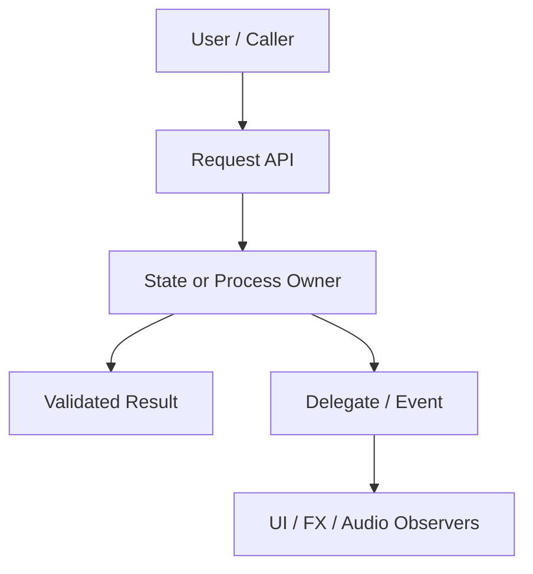
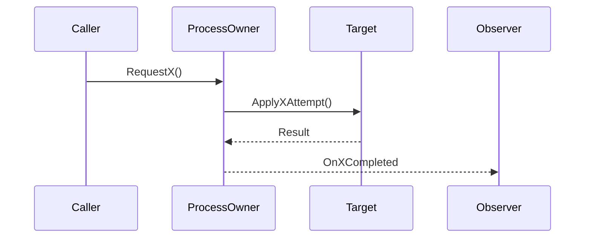
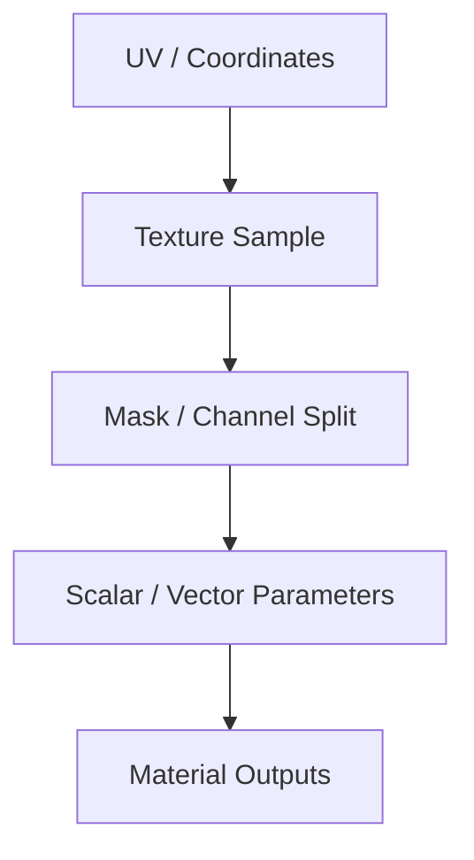
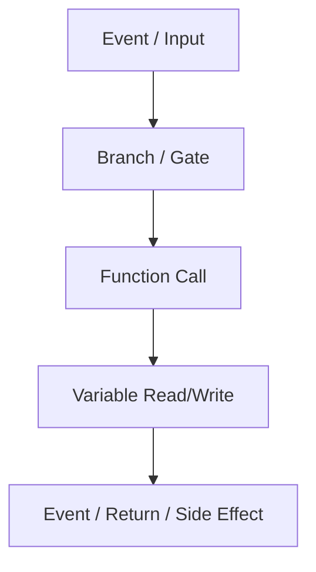

# Diagram Response Rules

## Purpose

When analyzing project structure, ownership, dependencies, graph nodes, Blueprint flow, material flow, shader pipeline, or runtime call order, include a compact diagram directly in the chat response.

Use diagrams to make structure visible to small local models and to the user. The diagram is evidence-backed explanation, not proof that code or assets were changed.

Output in this order:

1. A Mermaid diagram first, for clients that render Mermaid.
2. A plain ASCII/text fallback second, so LM Studio or other non-rendering chat windows still show the structure immediately.

## When To Include A Diagram

Include a diagram when the answer contains any of these:

- architecture or responsibility split
- module/plugin dependency structure
- Actor/Component/Subsystem ownership
- Command/Query/Event flow
- Blueprint graph or function-call analysis
- material node graph or texture/parameter flow
- shader/plugin/render pipeline setup
- runtime sequence, event broadcast, replication, or async/render-thread flow

Skip the diagram only when the answer is a tiny factual answer, a single compile error fix, or the user asks for text only.

## Diagram Type Selection

- Use `flowchart TD` for ownership, dependency, material graph, Blueprint node graph, and shader pipeline structure.
- Use `sequenceDiagram` for request/call/event/runtime order.
- Use `classDiagram` only for class/interface inheritance or API surface summaries.
- Use `stateDiagram-v2` only for explicit state machines.

## Mermaid Safety Rules

- Keep diagrams small: 5 to 12 nodes by default.
- Use short ASCII node IDs such as `Player`, `WeaponComp`, `DamageTarget`, `Material`, `Texture`.
- Put Korean or long labels inside quoted Mermaid labels, for example `A["State Owner"]`.
- Do not use raw file paths as node IDs. Put paths in labels or a text list below the diagram.
- Do not show uncertain relationships as facts. Use dashed arrows for inferred or proposed relationships.
- Always put the Mermaid block before the plain ASCII/text fallback. Do not rely on Mermaid rendering alone.
- In `sequenceDiagram`, do not use Mermaid keywords such as `participant`, `actor`, or `end` as participant IDs. Use short IDs like `P`, `CinePart`, or `TargetActor`, and quote aliases with parentheses or slashes.

## Plain Text Fallback Rules

- Put the fallback immediately after the Mermaid block.
- Use `text` fenced code or a short `Diagram:` block.
- Keep it to 4 to 10 lines.
- Use arrows such as `->`, `<-`, and `-- inferred -->`.
- Keep the same node order as the Mermaid diagram.
- Mark uncertain links as `-- inferred -->` or `-- proposed -->`.

## Structure Diagram Template



```text
User / Caller
  -> Request API
  -> State or Process Owner
  -> Validated Result
  -> Delegate / Event
  -> UI / FX / Audio Observers
```

## Sequence Diagram Template



```text
Caller -> ProcessOwner: RequestX()
ProcessOwner -> Target: ApplyXAttempt()
Target -> ProcessOwner: Result
ProcessOwner -> Observer: OnXCompleted
```

## Material Diagram Template



```text
UV / Coordinates
  -> Texture Sample
  -> Mask / Channel Split
  -> Scalar / Vector Parameters
  -> Material Outputs
```

## Blueprint Diagram Template



```text
Event / Input
  -> Branch / Gate
  -> Function Call
  -> Variable Read/Write
  -> Event / Return / Side Effect
```

## Response Contract

For structure analysis, answer in this order:

1. Short conclusion.
2. Mermaid diagram.
3. Plain text diagram fallback.
4. Responsibility or dependency table.
5. Risks or unstable edges.
6. Evidence citations.

For screenshot-based Material or Blueprint analysis, answer in this order:

1. Visible facts.
2. Mermaid diagram of the visible or exported graph.
3. Plain text diagram fallback.
4. Parameters, textures, variables, function calls.
5. Unknown/cropped/unreadable nodes.
6. Next metadata or file checks.
