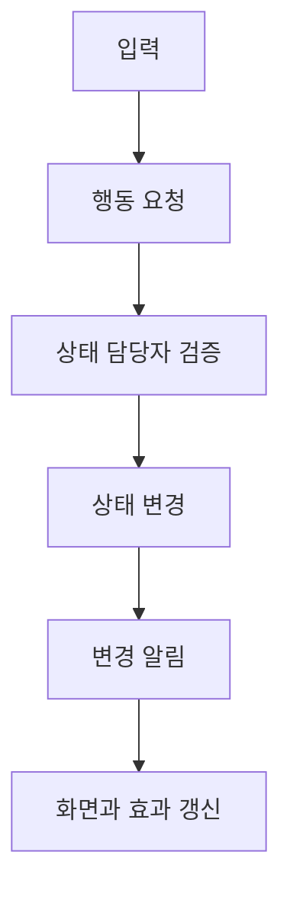

# 구조·호출 순서 도식 작성 기준

책임·의존성·노드 연결·호출 순서를 설명할 때 작은 도식이 도움이 되면 함께 보여주어야 합니다. 도식은 확인한 구조의 설명이며 실제 수정 증거는 아닙니다.

Mermaid를 먼저 사용합니다. 이를 표시하지 못하는 환경을 위한 ASCII 텍스트 도식은 Mermaid 블록 다음에 둡니다. 단순 사실 하나나 한 줄 수정에는 억지로 넣지 않습니다.

구조는 `flowchart TD`, 시간 순서는 `sequenceDiagram`, 상속은 `classDiagram`, 명시적인 상태 전이는 `stateDiagram-v2`를 사용합니다. 보통 5~12개 노드로 줄이고 짧은 영문 식별자와 따옴표 안의 한글 설명을 사용합니다. 파일 경로를 식별자로 쓰지 말아야 합니다.

확인하지 않은 관계는 점선과 “추정”·“제안” 표시로 구분합니다. 순서 도식에서 `participant`, `actor`, `end` 같은 예약어를 참여자 식별자로 사용하지 않습니다.


```mermaid
flowchart TD
    A["입력"] --> B["행동 요청"]
    B --> C["상태 담당자 검증"]
    C --> D["상태 변경"]
    D --> E["변경 알림"]
    E --> F["화면과 효과 갱신"]
```

```text
입력 -> 행동 요청 -> 상태 담당자 검증
     -> 상태 변경 -> 변경 알림 -> 화면과 효과 갱신
```

도식 아래에는 필요한 책임표·위험·근거를 적습니다. 캡처를 설명한다면 보이는 연결만 그리고 가려진 노드와 필요한 추가 자료를 따로 적어야 합니다.
