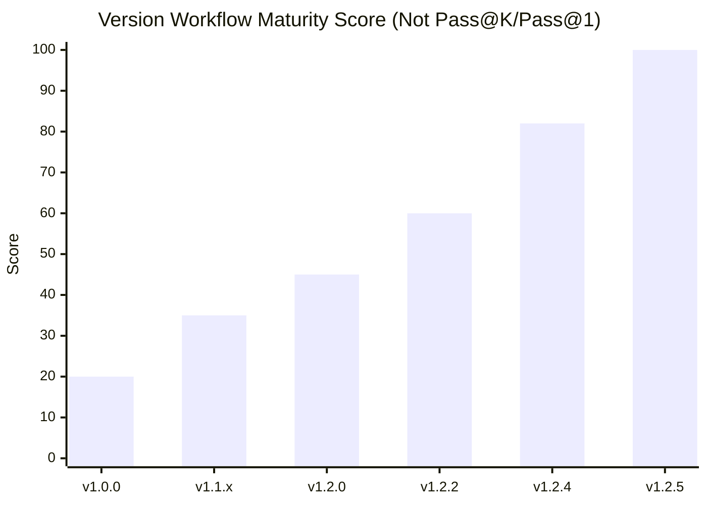
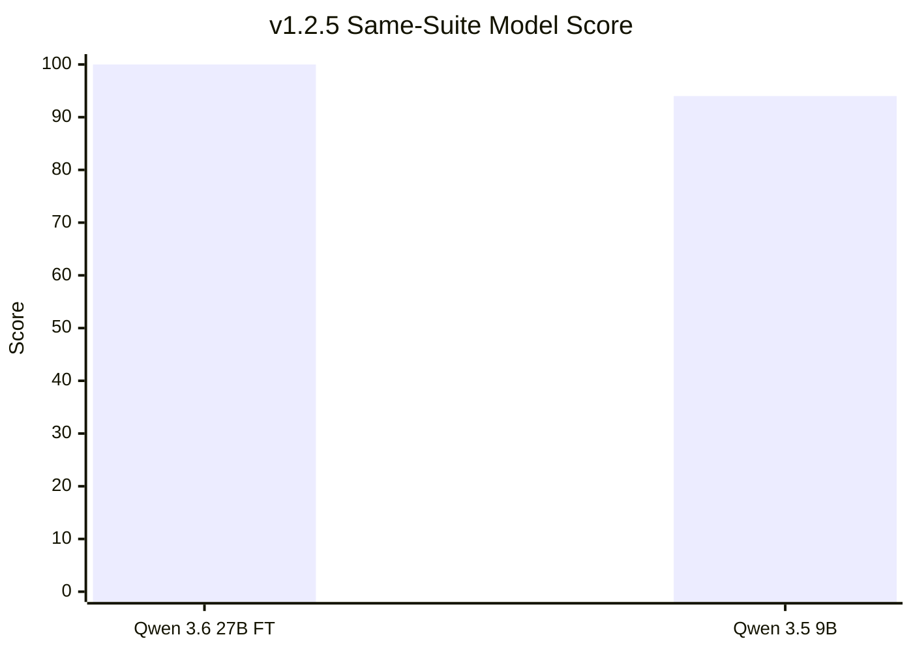
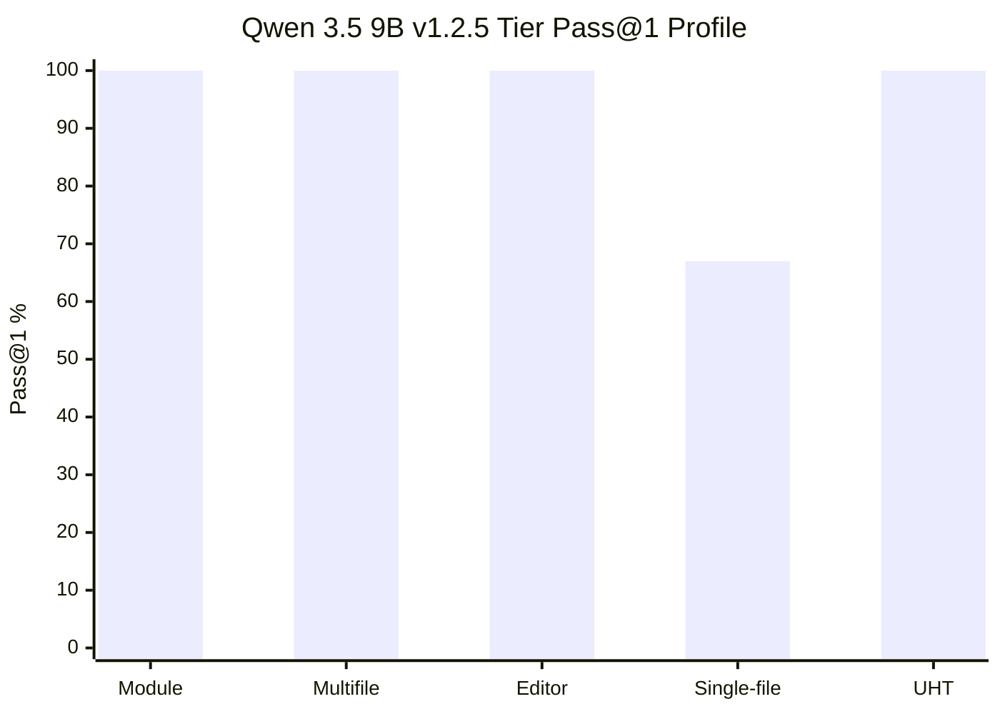
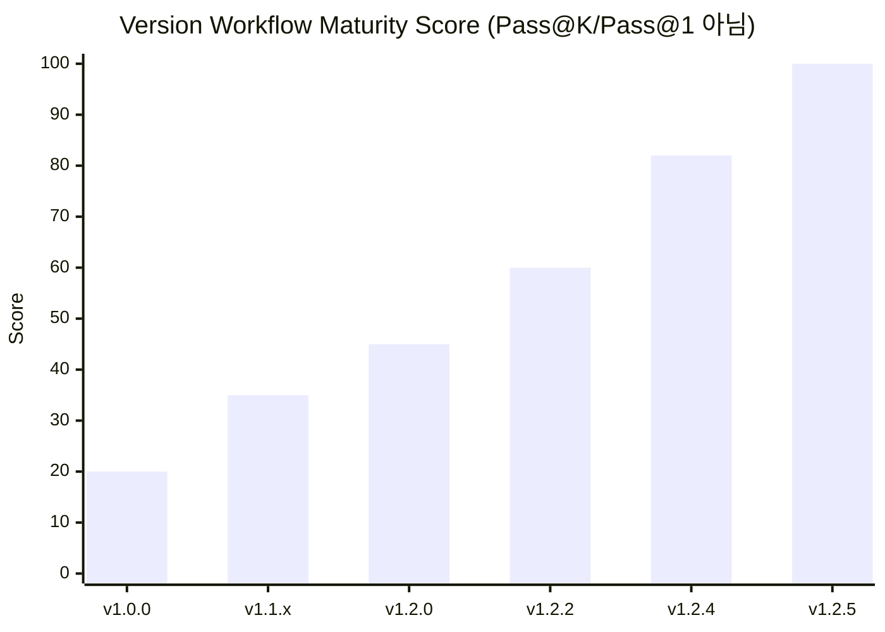

# Version Performance History

[English](#english) | [한국어](#korean)

## English

This page summarizes the evolution from v1.0.0 to v1.2.5. The test suites changed over time, so numbers should be read as saved milestone evidence, not as a perfectly controlled apples-to-apples benchmark.

## Visual Scorecards

The charts below intentionally avoid using Pass@K/Pass@1 as the cross-version score, because the suite changed across releases. Instead:

- **Version workflow maturity score** is a qualitative 0-100 score for evaluation maturity, safety guardrails, compile-fix coverage, multifile handling, and repeatability.
- **Model live score** is only used inside the same v1.2.5 36-case live suite, where the two measured models ran against the same case set.

| Version | Workflow maturity score | Why |
|---|---:|---|
| v1.0.0 | 20 | Initial RAG/MCP proof of concept; no stable live KPI. |
| v1.1.x | 35 | Better project routing and setup, but weak write/eval guardrails. |
| v1.2.0 | 45 | First live UBT direction with a small 5-case baseline. |
| v1.2.2 | 60 | Major safety gains: static validation, write guards, deletion flow. |
| v1.2.4 | 82 | 36-case live loop became strong; multifile still had two blockers. |
| v1.2.5 | 100 | Final 1.2.x compile-fix baseline: 36-case live Pass@1 36/36 with zero wrong-file/Build.cs/no-op counters in the best run. |

| Model / run | Same-suite model score | Basis |
|---|---:|---|
| Community fine-tuned Qwen 3.6 27B (`20260709-144441-pass1-target`) | 100 | 36/36 Pass@K, 36/36 Pass@1, zero wrong-file/Build.cs/no-op counters. |
| Qwen 3.5 9B deepseek-v4-flash (`20260711-090534-qwen35-9b`) | 97 | 36/36 Pass@K, 35/36 Pass@1; post scoped-write-stabilization revalidation. |
| Qwen 3.5 9B (`20260709-153021-qwen35-9b`) | 94 | 35/36 Pass@K, 33/36 Pass@1; prior compact baseline, one missing-definition failure. |

## Summary Table

| Version | Main Focus | Saved Measurement / Evidence | Strengths | Weaknesses / Risks |
|---|---|---|---|---|
| v1.0.0 | Initial local Unreal RAG/MCP workflow | Early functional baseline; no stable 36-case KPI yet | Proved local LM Studio + UE knowledge retrieval could support Unreal C++ Q&A and patch planning. | Weak guardrails, weak write validation, limited repeatable evaluation. |
| v1.1.x | Safer MCP tool use and project-aware retrieval | Internal regression checks; no final 36-case live baseline | Better RAG setup, project routing, setup docs, and safer local workflow defaults. | Still vulnerable to wrong-file edits, Build.cs guessing, and insufficient static validation. |
| v1.2.0 | Real-project validation direction | 5-case early live baseline: 3/5 Pass@K, 3/5 Pass@1 | Began measurable live UBT loop instead of chat-only claims. | Small suite; compile-fix behavior still inconsistent. |
| v1.2.2 | Agent write safety | Static validation and deletion-safety hardening | Safer file writes, basename collision prevention, protected path checks, explicit deletion approval flow. | Safety improved faster than model success rate; still needed broader compile-fix regression gates. |
| v1.2.4 | Compile-loop stabilization | 36-case live `20260708-211549`: 34/36 Pass@K, 34/36 Pass@1 | Strong single-file/module/reflection baseline; extracted wrapper guard/evidence modules; improved retry state. | Multifile tier still had two failures: `local_multifile_uproperty_type_migration`, `local_multifile_callback_param_expand`. |
| v1.2.5 | Final 1.2.x compile-fix stabilization | Community fine-tuned Qwen 3.6 27B live `20260709-144441-pass1-target`: 36/36 Pass@K, 36/36 Pass@1. Qwen 3.5 9B live `20260709-153021-qwen35-9b`: 35/36 Pass@K, 33/36 Pass@1. | 12/12 multifile Pass@1; NavigationSystem false-positive fixed; editor-runtime boundary fixed; UObject lifecycle deterministic autofix; zero wrong-file edits / Build.cs false positives / no-op edits in the 27B run. | v1.2.x is now in maintenance. It is still a compile-fix suite, not a full semantic-refactor/runtime-debug benchmark. Average attempts is harness-specific because static autofix can count as attempt 0. |

## Field-Level Notes

| Field | Best v1.2.5 Result | Notes |
|---|---|---|
| Module dependencies / Build.cs | 10/10 Pass@1 in both Qwen 3.6 27B and Qwen 3.5 9B live runs | Strong after module routing and Build.cs false-positive guards. |
| Multifile refactor compile fixes | 12/12 Pass@1 in both measured runs | Strongest v1.2.5 gain. Deterministic autofix now protects callback and return-type drift cases. |
| Editor/runtime boundary | 1/1 Pass@1 in both measured runs | Hardened against adding `UnrealEd` to runtime Build.cs as a fake fix. |
| UHT / reflection | 4/4 Pass@1 in both measured runs | Strong with deterministic blueprint/native event autofixes. |
| Single-file compile fix | 9/9 Pass@1 on Qwen 3.6 27B; 8/9 Pass@1 and 9/9 Pass@K on Qwen 3.5 9B (20260711); 6/9 Pass@1 on prior 9B baseline | Compact gap narrowed; remaining Pass@1 miss is one include-registration retry case. |

## Maintenance Policy After v1.2.5

v1.2.x is considered feature-complete for the compile-fix line. There will be no additional minor feature releases in the 1.2 series. Future 1.2.x changes should be limited to small bug fixes, documentation corrections, and low-risk stability patches.

The next feature track is v1.3.0, with development expected to start roughly four months after v1.2.5. It will use separate scorecards for compile-fix, semantic refactor, runtime debug, negative control, and advanced Unreal C++ capability.

## Korean

이 문서는 v1.0.0부터 v1.2.5까지의 발전 과정을 정리합니다. 중간에 테스트 suite가 바뀌었기 때문에, 수치는 완전히 동일 조건의 벤치마크가 아니라 저장된 milestone 근거로 읽어야 합니다.

## 시각화 점수표

아래 그래프는 버전 간 점수로 Pass@K/Pass@1을 직접 사용하지 않습니다. 버전마다 suite가 달라졌기 때문입니다. 대신 다음처럼 분리합니다.

- **Version workflow maturity score**: 평가 성숙도, safety guardrail, compile-fix coverage, multifile handling, repeatability를 기준으로 한 정성적 0-100 점수입니다.
- **Model live score**: 동일한 v1.2.5 36-case live suite에서 실행한 모델끼리만 비교합니다.

| 버전 | Workflow maturity score | 이유 |
|---|---:|---|
| v1.0.0 | 20 | 초기 RAG/MCP proof of concept; 안정된 live KPI 없음. |
| v1.1.x | 35 | project routing과 setup 개선, 하지만 write/eval guardrail은 약함. |
| v1.2.0 | 45 | 작은 5-case baseline으로 live UBT 측정을 시작. |
| v1.2.2 | 60 | static validation, write guard, deletion flow 등 safety가 크게 개선. |
| v1.2.4 | 82 | 36-case live loop가 강해짐; multifile blocker 2건은 남음. |
| v1.2.5 | 100 | 최종 1.2.x compile-fix baseline. 최고 run에서 36-case live Pass@1 36/36 및 wrong-file/Build.cs/no-op counter 0. |

| 모델 / run | Same-suite model score | 기준 |
|---|---:|---|
| Community fine-tuned Qwen 3.6 27B (`20260709-144441-pass1-target`) | 100 | 36/36 Pass@K, 36/36 Pass@1, wrong-file/Build.cs/no-op counter 0. |
| Qwen 3.5 9B deepseek-v4-flash (`20260711-090534-qwen35-9b`) | 97 | 36/36 Pass@K, 35/36 Pass@1. scoped write stabilization 이후 재검증. |
| Qwen 3.5 9B (`20260709-153021-qwen35-9b`) | 94 | 35/36 Pass@K, 33/36 Pass@1. 이전 compact baseline, missing-definition 1건 실패. |

## 요약 표

| 버전 | 핵심 목표 | 저장된 측정 / 근거 | 강점 | 약점 / 리스크 |
|---|---|---|---|---|
| v1.0.0 | 초기 로컬 Unreal RAG/MCP workflow | 초기 기능 baseline; 안정된 36-case KPI는 아직 없음 | LM Studio + UE 지식 검색으로 Unreal C++ Q&A와 patch planning이 가능함을 확인. | guardrail, write validation, 반복 가능한 평가가 약함. |
| v1.1.x | 더 안전한 MCP tool use와 project-aware retrieval | 내부 regression check; 최종 36-case live baseline은 없음 | RAG setup, project routing, setup docs, 로컬 workflow 기본값 개선. | wrong-file edit, Build.cs 추측, static validation 부족 리스크가 남음. |
| v1.2.0 | real-project validation 방향 전환 | 초기 5-case live baseline: 3/5 Pass@K, 3/5 Pass@1 | chat-only 주장이 아니라 live UBT loop로 측정하기 시작. | suite가 작고 compile-fix 안정성이 아직 낮음. |
| v1.2.2 | agent write safety | static validation과 deletion-safety 강화 | 안전한 파일 쓰기, basename collision 방지, protected path 검사, 명시적 삭제 승인 flow. | 안전성은 좋아졌지만 compile-fix 성공률 측정과 regression gate는 더 필요했음. |
| v1.2.4 | compile-loop stabilization | 36-case live `20260708-211549`: 34/36 Pass@K, 34/36 Pass@1 | single-file/module/reflection baseline 강화; wrapper guard/evidence 모듈 분리; retry state 개선. | multifile tier에서 `local_multifile_uproperty_type_migration`, `local_multifile_callback_param_expand` 2건 실패. |
| v1.2.5 | 최종 1.2.x compile-fix 안정화 | Community fine-tuned Qwen 3.6 27B live `20260709-144441-pass1-target`: 36/36 Pass@K, 36/36 Pass@1. Qwen 3.5 9B live `20260709-153021-qwen35-9b`: 35/36 Pass@K, 33/36 Pass@1. | 12/12 multifile Pass@1; NavigationSystem false-positive 수정; editor-runtime boundary 수정; UObject lifecycle deterministic autofix; 27B run에서 wrong-file edit / Build.cs false positive / no-op edit 0. | v1.2.x는 maintenance 단계. 여전히 compile-fix suite이며 semantic-refactor/runtime-debug 전체 benchmark는 아님. Average attempts는 static autofix가 attempt 0으로 기록될 수 있어 해석 주의. |

## 분야별 메모

| 분야 | v1.2.5 최고 결과 | 메모 |
|---|---|---|
| Module dependency / Build.cs | Qwen 3.6 27B, Qwen 3.5 9B 모두 10/10 Pass@1 | module routing과 Build.cs false-positive guard 이후 강해짐. |
| Multifile refactor compile fix | 두 측정 run 모두 12/12 Pass@1 | v1.2.5의 가장 큰 개선점. callback/return-type drift deterministic autofix로 보호. |
| Editor/runtime boundary | 두 측정 run 모두 1/1 Pass@1 | runtime Build.cs에 `UnrealEd`를 추가하는 fake fix를 차단. |
| UHT / reflection | 두 측정 run 모두 4/4 Pass@1 | blueprint/native event deterministic autofix 경로가 강함. |
| Single-file compile fix | Qwen 3.6 27B는 9/9 Pass@1; Qwen 3.5 9B (20260711)는 8/9 Pass@1, 9/9 Pass@K; 이전 9B baseline은 6/9 Pass@1 | compact gap 축소; 남은 Pass@1 miss는 include-registration retry 1건. |

## v1.2.5 이후 유지보수 정책

v1.2.x는 compile-fix 라인 기준 feature-complete로 봅니다. 1.2 series에 추가적인 minor feature release는 예정하지 않습니다. 이후 1.2.x 변경은 간단한 bug fix, 문서 수정, 낮은 위험도의 안정화 patch로 제한합니다.

다음 feature track은 v1.3.0이며, v1.2.5 이후 약 4개월 뒤부터 개발 시작을 목표로 합니다. v1.3.0에서는 compile-fix, semantic refactor, runtime debug, negative control, advanced Unreal C++ capability를 분리된 scorecard로 측정합니다.
